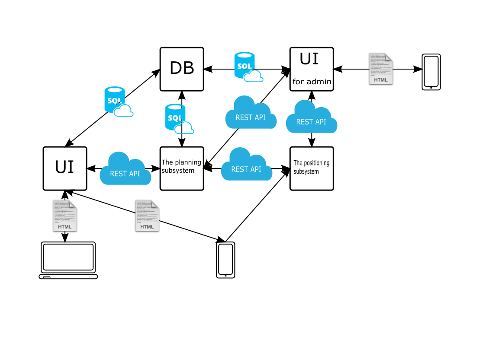

## Описание системы
Общий вид представлен на рисунке. 

 Рис. 1 Общее представление системы.

Система состоит из четырех компонент, о которых пойдет речь далее.

### 1) Подсистема позиционирования
Данная компонента отвечает за определение местоположения сотрудников 
на предприятии. На текущий момент есть 3 возможных способа ее реализации:

#### 1) C использованием смартфона
Данный метод подразумевает, что смартфон сотрудника будет непрерывно мониторить
сигнал от близ лежащих маячков. Схема показана на рисунке.

 

 Рис.2 Позиционирование с помощью смартфона. Маячки отмечены символами a, b, c.

Смартфон измеряет расстояния от bluetooth-маячков L1, L2 и L3. 
Поскольку начальные координаты маячков нам известны, математическими методами можно определить позицию сотрудника. Полученный результат отправляется в подсистему планирования.

+Плюсы:  
1) Сравнительная простота реализации: можно использовать готовые компоненты, например Google Beacon Platform [или](https://github.com/Navigine/).
2) Не требует дополнительных приемников bluetooth сигнала.  

-Минусы
1) Предположительно низкая устойчивость к помехам в
условиях завода. На пути от источника к приемнику сигнала могут находиться металлические "предметы": многотонные станки и прочее оборудование, которое может давать сильнейшие наводки.
2) Нужно достаточно много маячков для определения точной позиции.

#### 2) С использованием цифровых отпечатков.
В отличии от предыдущей методики, bluetooth-маячки
не расположены статически, а закреплены за сотрудниками.
Для данного подхода необходимы отдельные bluetooth-приемники,
установленные на стенах или потолках здания. Они непрерывно измеряют уровень сигнала, исходящего от маячков, определяют
значение расстояния и отправляют его по сети в главный узел подсистемы. Тот в свою очередь хранит виртуальную сетку - цифровые отпечатки или RSSI карты Bluetooth.

 Рис.3 Позиционирование с помощью цифровых отпечатков. 
 Приемника blutooth-сигнала помечены как <b>c</b>, <b>d</b>.

Для каждой точки сетки определены ее координаты, массив уровней сигналов для каждого bluetooth-приемника. Эта информация занесена с систему заранее.
Позиция маячка сотрудника определяется по алгоритму ближайших соседей, как показано на рисунке. Так для маячка **a**
координаты определяются по точкам A1...4, а
для маячка **b** по B1...3. Для более точного определения позиции маячка внутри клетки сетки можно применить функции сглаживания.  

Нетрудно заметить, что для приемника <b>с</b> уровень сигнала
маячка в точках A1 и A4 будет одинаково, что плохо влияет на определение точного местоположения. Для борьбы с неоднозначностью необходимо 
как минимум 3 приемника.

Приведенная выше схема подходит не только для blutooth-сигнала, но и для Wi-fi.

+Плюсы: 
1) Хорошая устойчивость к постоянным помехам.

-Минусы
1) Требует трудоемкой предварительной настройки - создание виртуальной сетки.
2) Необходимы отдельные приемники сигнала.

#### 3) С использованием геометрии.
Как с предыдущем методе, маячки переносятся сотрудниками. Для построения такой системы необходимо 3 bluetooth-приемника, два из которых работают в режиме 
slave, а один в master. Логика работы этих режима немного различается.
Режим slave: 
1) измеряет расстояние до всех доступных маячков
2) передает массив расстояний в master-приемник.

В свою очередь master-приемник:  
1) измеряет расстояние до всех доступных маячков  
2) принимает массив данных от двух slave-приемников
3) рассчитывает позиции доступных маячков (координаты x, y)
4) передает измеренные координаты в систему планирования

Рис.4 Позиционирование с помощью виртуальной сетки.  
Приемника bluetooth-сигнала помечены как <b>c</b>, <b>d</b>.

На рисунке приемники <b>b</b>, <b>c</b> работают в режиме slave, а приемник <b>a</b> как master. При настройке системы требуется измерить расстояния <b>L1</b> и <b>L2</b>. 
Зная стороны треугольников <b>U1</b>, <b>U2</b>, <b>L1</b> и 
<b>U3</b>, <b>U2</b>, <b>L2</b> можно определить координаты маячка
<b>x</b> и <b>y</b>.

+Плюсы
1) Не требует серьезной настройки (по сравнению с предыдущим методом)

-Минусы
1) Необходимы отдельные приемники сигнала.

#### Резюме
На данный момент наиболее выгодной будет первый метод,
поскольку уже существуют проверенные библиотеки для
реализации. Не факт, что другие два способа решат проблему сильных шумов.

Взаимодействовать с другими подсистемами будет только главный узел. Так же он будет пытаться решать некоторые
проблемы устранения шумов.
Работа с подсистемой позиционирования происходит с помощью REST API.

### 2) Подсистема планирования и распределения заданий
Данная подсистема распределяет задания работникам в зависимости от составленного заранее расписания и расположения первых.

Данный модуль будет реализован в виде отдельного микросервиса.

### 3) Подсистема взаимодействия с пользователями (UI)
Подсистема отвечает за представления вывода базы данных
и системы планирования в удобно читаемом для пользователей виде.

Предполагается разный UI для работников, управленцев и системных администраторов. Последним предоставляется 
гораздо больше возможностей воздействия на систему.

В плане реализации представляет собой веб-сервер, взаимодействующий c мобильным клиентом на смартфоне и/или браузером на десктопе. 